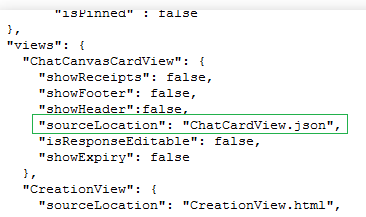

# Customizing ChatCanvasCardView

Unlike the creation, response and summary views that are html, chat views are native views. To customize the chat card view, you will need to provide a json of the card layout as well as the values in the view. In the absence of a customized chat canvas card view, the default would be chat card view with the text of app title. 

## Views and their supported properties
Below are different types of sub-views/widgets along with their customizable properties. Few properties are marked with <sup>iOS</sup>  indicating that they are applicable only on iOS _(and will have no effect on android)_.

### Container / View

<ol>
<li>id (optional, but must be unique)</li>
<li>visible<sup>iOS</sup></li>
<li>type <em>(any of the sub-view types we are mentioning here)</em></li>
<li>margin / marginTop / marginRight / marginBottom / marginLeft</li>
<li>padding / paddingTop / paddingRight / paddingBottom / paddingLeft</li>
<li>width</li>
<li>height</li>
<li>weight <em>(%ratio of parent view&#39;s width/height in case of horizontal/vertical layouts respectively)</em></li>
<li>backgroundColor  <em>(only hex code allowed here)</em></li>
<li>cornerRadius</li>
<li>borderWidthiOS / borderColoriOS</li>
<li>children <em>(array of sub-views)</em></li>
<li>layout <em>(vertical / horizontal � when unspecified, defaults to vertical)</em></li>
<li>verticalAlignment <em>(top / bottom / center / stretchiOS - how children will be aligned vertically)</em></li>
<li>horizontalAlignment <em>(left / right / center / spaceBetween<sup>iOS</sup> / spaceAround<sup>iOS</sup>) - how children will be aligned horizontally.</em></li>
<li>initialHeight<sup>iOS</sup> � <em>an iOS only property used in the topmost container that is used to render the card before the accurate dimension is ascertained. It is strongly advised to use this property for a smoother experience!</em></li>
</ol>

### Text

<ol>
<li>id (optional, but must be unique)</li>
<li>visible<sup>iOS</sup></li>
<li>type <em>(any of the sub-view types we are mentioning here)</em></li>
<li>margin / marginTop / marginRight / marginBottom / marginLeft</li>
<li>padding / paddingTop / paddingRight / paddingBottom / paddingLeft</li>
<li>width</li>
<li>height</li>
<li>weight <em>(%ratio of parent view&#39;s width/height in case of horizontal/vertical layouts respectively)</em></li>
<li>backgroundColor  <em>(only hex code allowed here)</em></li>
<li>cornerRadius</li>
<li>borderWidthiOS / borderColoriOS</li>
<li>string</li>
<li>fontSize <em>(font family is always System&#39;s default, to avoid rendering issues)</em></li>
<li>textColor <em>(only hex code allowed here)</em></li>
<li>ellipsizeMode <em>(head / middle / tail)</em></li>
<li>maxNumberOfLines <em>(0 for no limit, else text will be truncated as per ellipsizeMode)</em></li>
</ol>


### Image

<ol>
<li>id (optional, but must be unique)</li>
<li>visible<sup>iOS</sup></li>
<li>type <em>(any of the sub-view types we are mentioning here)</em></li>
<li>margin / marginTop / marginRight / marginBottom / marginLeft</li>
<li>padding / paddingTop / paddingRight / paddingBottom / paddingLeft</li>
<li>width</li>
<li>height</li>
<li>weight <em>(%ratio of parent view&#39;s width/height in case of horizontal/vertical layouts respectively)</em></li>
<li>backgroundColor  <em>(only hex code allowed here)</em></li>
<li>cornerRadius</li>
<li>borderWidthiOS / borderColoriOS</li>
<li>source</li>
<li>contentMode <em>(aspectFit / aspectFill / stretch / repeat<sup>iOS</sup>)</em></li>
</ol>


## Binding data with views
* __Form__
  * $\{Form.title}
  * $\{Form.expiry} - _output is a date-time string_
  * $\{Form.questions}
  * $\{Form.questions.length}
  * $\{Form.questions[questionId].title}
  * $\{Form.questions[questionId].options}
  * $\{Form.questions[questionId].options.length}
  * $\{Form.questions[questionId].options[optionId].text}
  * $\{Form.questions[questionId].options[optionId].pictureUrl}
  * $\{Form.properties}
  * $\{Form.properties.length}
  * $\{Form.properties[propertyName]}
  * $\{Form.properties[propertyName].value}
  * $\{Form.properties[propertyName].length} - _for Array/Set type property_
* __MyLatestResponse__
  * $\{MyLatestResponse.sendTime} - _output is a date-time string_
  * $\{MyLatestResponse.questionToAnswerMap[questionId]}
* __Summary__
  * $\{Summary.totalResponseCount}
  * $\{Summary.totalParticipantsCount}
  * $\{Summary.targetResponderCount}

Also one can use these variables as placeholders, like:  
_"Thanks for your news report: ${Form.properties[newsDescription].value}"_

## Operations

In some scenarios, there may arise a need where different users may need to view different chat card, that may be based on some attributes. In order to enable such scenarios, Kaizala provides [operators](Operator.md), that enables Action Creators to personalise chat card views for the same Action instance differently for different scenarios/users.

For example, you may choose to show a different card view for users who have not completed the job, and a different card view for users who have completed the job. This can be extended to any type of scenarios that may arise.

## How to provide the json schema
In the manifest _(package.json)_ file of a package put the JSON file name under **sourceLocation** key in **ChatCanvasCardView**
Below is a sample snapshot from package.json:



## Example ChatCanvasCardView source file
```json
{
    "schemaVersion": 1,
    "schema": {
        "type": "container",
        "initialHeight": 300,
        "layout": "vertical",
        "children": [
            {
                "type": "text",
                "paddingLeft": 10,
                "paddingRight": 10,
                "string": "${Form.properties[Property1].value}",
                "fontSize": 18,
                "fontStyle": "bold",
                "textColor": "#CE222E",
                "textAlignment": "left",
                "maxNumberOfLines": 2,
                "marginBottom": 10
            },
            {
                "type": "image",
                "height": 160,
                "source": "${Form.properties[CoverImageProperty].value}",
                "contentMode": "aspectFit",
                "backgroundColor": "#263749",
                "marginBottom": 10
            },
            {
                "type": "text",
                "paddingLeft": 10,
                "paddingRight": 10,
                "string": "${Form.properties[Property2].value}",
                "fontSize": 18,
                "fontStyle": "bold",
                "textColor": "#32495f",
                "textAlignment": "left",
                "maxNumberOfLines": 4,
                "marginBottom": 0
            }
        ]
    }
}
