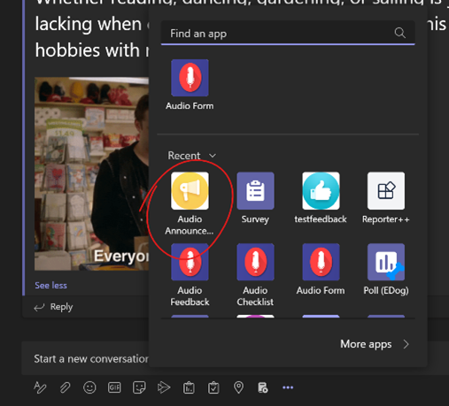

# Kaizala to Teams Conversion Service

In April’19, it was [announced](https://techcommunity.microsoft.com/t5/microsoft-kaizala-blog/microsoft-kaizala-rolls-out-to-office-365-customers-globally-and/ba-p/394298) that Microsoft Kaizala capabilities will be integrated into Teams and the customers would need to eventually transition to Microsoft Teams. As a part of this customer promise, Kaizala to Teams Conversion Service was built as a part of the customer promise to help them convert their custom Kaizala actions to Teams with minimal costs.

Using Kaizala to Teams Conversion Service, customers can  convert their existing custom apps from Kaizala to Teams in minimal steps and at no additional investment from their end. This service can be used by tenant admins, developers, and business admins alike. Depending on the kind of access you have you can follow one of the following two processes:

1.  **Using Kaizala Management Portal:** If you have access to Kaizala Management Portal, then use ‘Move to Teams’ feature added to app detail info page to convert your Kaizala Action to a Teams app.
    
2.  **Using Windows Command Line tool:** If you have a Kaizala Action Package file and need it converted to Teams app, then you can use the command line tool available on Windows for conversion process.
    
Once the Teams app file is downloaded, the next step is to add it to Teams either through the Teams Admin Portal, or by sideloading it from Teams desktop or web client. Make sure you have access to AAD account of the tenant you want to migrate the app to and have permission to access Teams Admin Portal or can sideload the app from Teams client.

Please refer to  the documentation below to understand how to convert custom Kaizala action package to Teams app using either of the above two processes:

### Using Kaizala Management Portal

**Prerequisites**
 -   Access to Kaizala Management Portal
 -   AAD account in Teams tenant you wish to migrate the action to
 -   Access to Teams Admin Portal, or permission to sideload apps from Teams client
   
**Conversion Steps**
1.  Log-in to [https://manage.kaiza.la/](https://nam06.safelinks.protection.outlook.com/?url=https%3A%2F%2Fmanage.kaiza.la%2F&data=04%7C01%7CShubham.Chauhan%40microsoft.com%7C932fbe03e76947f2481808d958bffb5a%7C72f988bf86f141af91ab2d7cd011db47%7C0%7C0%7C637638403898906363%7CUnknown%7CTWFpbGZsb3d8eyJWIjoiMC4wLjAwMDAiLCJQIjoiV2luMzIiLCJBTiI6Ik1haWwiLCJXVCI6Mn0%3D%7C1000&sdata=p9EVATIYFHj2I48qHHlq1Eg4aVEpoi%2BtsvUzi7tcU%2FE%3D&reserved=0) with admin credentials
2.  Go to ‘Actions’ item in the left navigation bar
3.  Select any Kaizala Action Designer built action from the list of actions shown. These actions would be based on Survey, Forms, Announcement, and other available templates.
4.  In the next screen select the latest active version of the app in case there are multiple versions available.
5.  You’ll find a new column added in the actions details page titled ‘Teams App’
 

	
 6. Click on the ‘+’ button to get started with the conversion process.

 7.  Few developer details need to be provided in first step of the conversion process which are a requirement for creating a Teams app. You may use your company’s URLs  here which could be along these lines:
 
        - Developer name: Name of Kaizala admin who created the action in Kaizala
		- Developer Website URL: [https://www.contoso.com/](https://www.contoso.com/)
		- Developer Terms URL: [https://www.contoso.com/terms](https://www.contoso.com/terms)
		- Developer Privacy URL: [https://www.contoso.com/privacy-policy](https://www.contoso.com/privacy-policy)

8.  Read and accept the terms  of usage and hit next to initiate the conversion process. You could close the conversion dialog as the conversion happens in the background.
9.  Once conversion is complete, you’ll get an option to download the converted Teams app next to the convert button. Click on the button to download the converted Teams app.
10. Upload the app to Teams by going to ‘App Store -> Upload a custom app’ and then add it to a channel, group chat or a meeting chat. Alternatively, you may choose to upload it to Teams Admin Center and then enable it for selected teams. Find more details [here](/microsoftteams/platform/concepts/deploy-and-publish/apps-upload).
	
	
	
11. Once added to a team or group chat you might need to create a Tab for apps based on Form, Feedback and Attendance templates to work. Request to add a tab is prompted automatically when the app is added, or you may choose to do it manually by clicking on ‘+’ button next to tabs and picking the installed app from the list (image shared below). Find more details [here](https://support.microsoft.com/en-us/office/add-an-app-to-microsoft-teams-b2217706-f7ed-4e64-8e96-c413afd02f77).

	

12. Now, with the tab set up, the users can start responding by going to Messaging Extensions flyout by clicking on ‘…’ button below compose box (image shared below). 
13. The aggregated responses will either be available by clicking ‘View Details/Results’ on the card itself, or by opening the tab added in step #10. 

### Using Windows Command Line tool 

**Prerequisites**

- Install Node.js (using https://nodejs.org/en/download/ ) locally on your machine. 
- Download Kaizala Package locally that you want to transform into teams app. If you don't have any Kaizala package you can download zip from the Kaizala Management Portal (https://manage.kaiza.la/MiniApps/MiniApps) 

**Conversion Steps**

1. Open Command Line on your machine 
2. Install action-package-deploy tool by running below command: 
	
		npm install -g action-package-deploy 

3. To convert the Kaizala package to Teams app run below command: 

		transform-kaizala-package -k <KaizalaPackageZipPath> -a <ActionPackageDownloadPath> [-t <TeamsAppDownloadPath>] [-p <ParameterJsonPath>] [--dn <DeveloperName> --dw <DeveloperWebsiteUrl> --dp <DeveloperPrivacyUrl> --dt <DeveloperTermsUrl>] 

	Parameters: 

		-k : Path of the kaizala package zip to transform. 
		-a : Path to download transformed action package. 
		-t : Path to download Teams app for sideloading on teams. 
		-p : Path of the json file that contains additional parameters. 

	Currently, json file supports additional parameters for developer details, which are absent in kaizala package and needed for creating a Teams app. It can be fed to the command using a json file like below: 

		{​  ​  
		"developer":  
		{   ​  ​ 
			"name": "Contoso", 
			"websiteUrl": "https://www.contoso.com", 
			"privacyUrl": "https://www.contoso.com/privacy", 
			"termsOfUseUrl": "https://www.contoso.com/terms" 
		} 
		}​ 

	User can also provide developer details using below parameters: 

		--dn : Developer name. 
		--dw : Developer website url. 
		--dp : Developer privacy url. 
		--dt : Developer terms of use url. 

	Sample Command: 

		transform-kaizala-package -k C:\Users\Contoso\Attendence\attendence.zip -a C:\Users\Contoso\Attendence -t C:\Users\Contoso\Attendence --dn Contoso --dw https://www.contoso.com –dp https://www.contoso.com/privacy --dt https://www.contoso.com/terms 

5. Once executed, user would be asked to validate AAD credentials to be used for conversion of Kaizala action package to Teams app zip file.  
5. An AAD custom app and Bot are programmatically created in your tenant to power the converted app in Teams. 
6. Converted Teams App file would be available at the path provided in parameter [-t <TeamsAppDownloadPath>] in above command. User can side load the app the Teams using steps mentioned here. 
7. To make any modification in existing package, update the downloaded action package available at path -a <ActionPackageDownloadPath> and update the version field in the manifest. Make sure latest version number is higher than previous version number. Run the below command to download new Teams app file with the changes incorporated. 
	
		upload-action-package -z <ActionPackageZipPath> 
8. Once the Teams app is downloaded, follow the steps shared previously to install the app in Teams. 

## FAQs

**What data is captured in Kaizala to Teams Conversion Service and how it is used?**

Kaizala to Teams Conversion Service requires user to upload custom Kaizala action package to it and requires user to login with AAD account. Once uploaded, Conversion service converts action package to Teams app using AAD account for authentication. 
Additionally, user also needs to provide necessary developer information like website, Privacy URL, and Terms of use URL, to be used for creating Teams app file.  

Once the converted Teams app is downloaded, the uploaded Kaizala Action package is deleted from conversion service.  

**Which Kaizala actions can be converted to Teams Apps using Kaizala to Teams Conversion Service?**

Kaizala to Teams Conversion Service supports conversion of all custom actions built using Kaizala Action Designer, which includes Survey, Checklist, Announcements, etc. 

**Will data also be migrated to Teams with actions?  Will it impact existing action being used in Kaizala?**

Kaizala to Teams Conversion Service only converts Kaizala Actions to Teams Apps and does not migrate any data or users to Teams. Moreover, the conversion has no impact on existing action being used in Kaizala. The converted action will behave as an independent app in Teams and the data will be collected afresh. 

**Why is conversion failing?**

There can be multiple reasons why app conversion could fail. Some of the known reasons along with their mitigation is shared below: 

- Kaizala actions could have app icons in different formats like .jpg, but Teams only accept PNG format as a valid app icon file throwing error in other cases. To mitigate this issue, update the icon to PNG before converting Kaizala Action to Teams app. 

- Kaizala actions can have long title, but length of Teams actions’ title can be only 32 characters. To mitigate this issue trim Kaizala action’s title to 32 characters before converting the package to Teams. 

**Which features might not work in the converted Teams app?** 

Conversion of action-designer based cards will be supported on KMP. Meaning, custom action cards will not be convertible. Even within the supported ‘Action-designer based cards’ some features might not work due to reasons such as corresponding API not available on Teams Platform, or capability not supported in Kaizala actions. Describing the same below: 

 
Capabilities not supported in converted Teams app: 

- Send reminder 
- Duplicate a survey 
- Upload image from camera 
- Preview current location’s address and map image 
- Survey Action on Teams Desktop will not work if sharing current location is set to mandatory. This happens because required HTML5 API is not supported on Teams desktop client. 

### Privacy Statement  

This service is covered within the governance of Enterprise data usage policies. Find detailed Privacy statement of Microsoft here - [Microsoft Privacy Statement – Microsoft privacy](https://privacy.microsoft.com/en-us/privacystatement). 
