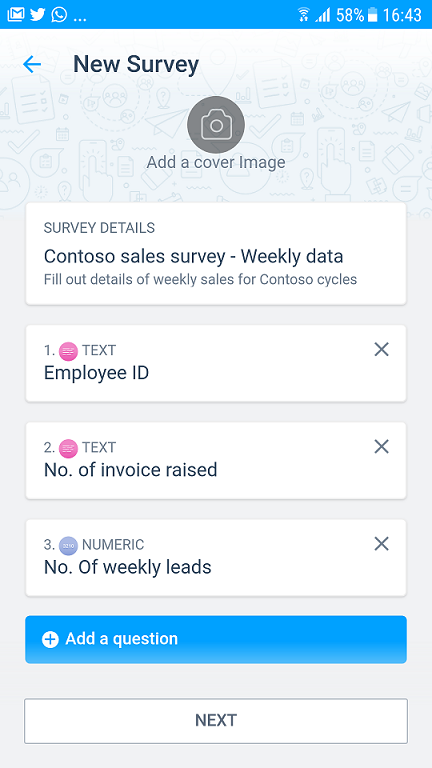
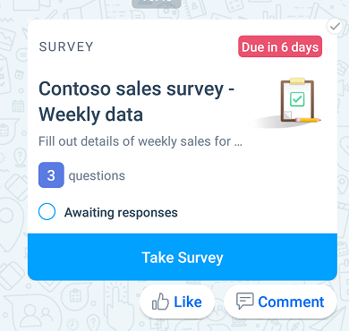
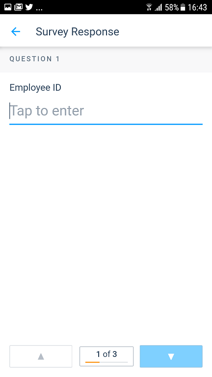
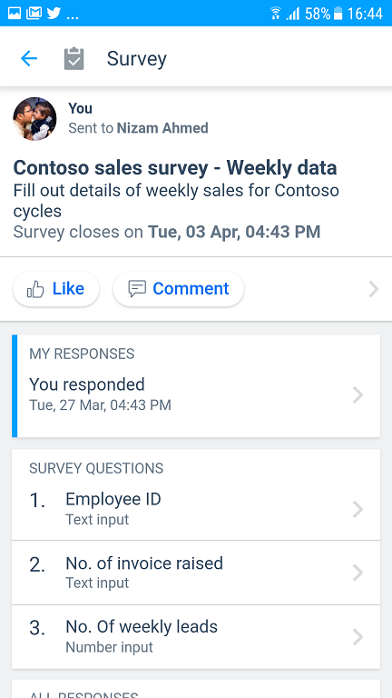

# Kaizala Actions

## Overview
Kaizala Actions are basic 'units of work' that help users to get their work done within a conversational context inside Kaizala. Some of these Actions like Job, Survey, Poll, etc. are shipped out-of-the-box. These Actions can be discovered within the Kaizala app and can be invoked in a chat from the Action Palette. [Read More](https://support.office.com/en-us/article/Kaizala-Actions-1EACC59A-DD14-43E9-B6B0-3C78773D5496).

We understand that the needs of every organization vary and they would require functionalities that would be very different from the needs of any other organization. Hence Kaizala enables development of custom Kaizala Actions that can be done by 3rd Party developers. These custom Actions can be deployed to a group, mapped within an organization context. 

All Actions that are published to a set of users can be invoked by them on any groups that Action had been added to. 

> **Note:** Custom Actions can only be added to organization groups.

> **Note :** [Kaizala Management Portal](https://manage.kaiza.la) is the gateway for all development, testing and publishing of new Kaizala Actions.

## Understanding Kaizala Action

A Kaizala Action currently contains four different views that can be defined as below:

* A **creation view** when an Action is invoked from the palette
* A **card view** that appears on the chat canvas when an instance of the Action is sent
* A **responder view** for users to respond to the Kaizala Action
* A **summary view** to view aggregated responses

For instance, in Out-of-Box(OOB) Kaizala Survey Action:

| View | Sample view in OOB Survey Action |
|------|----------------------------------|
| Creation view| |
| Card view | |
| Responder view | |
| Summary view | |

In custom Actions, you can create custom views that correspond to above views.

## Create a new Kaizala Action
You can create new Kaizala Actions that leverage Kaizala’s people network and mobile capabilities to create compelling experiences in the following ways:

* **Design** a new Kaizala Action through the Kaizala Management Portal - You can design a custom Kaizala Action through the Action Designer interface by building on the existing Action templates. [Read More](https://support.office.com/en-us/article/Kaizala-Actions-1eacc59a-dd14-43e9-b6b0-3c78773d5496?ui=en-US&rs=en-US&ad=US)
* **Develop** a new Kaizala Action - You can create complex new Kaizala Actions that provide custom functionality using web technologies like HTML, CSS and JavaScript. Follow the links below to learn about various stages of developement of a Kaizala Action.
    *   [Anatomy of a Kaizala Action package](anatomy.md)
    *   [Get Started](get_started.md)
    *   [Develop](develop.md)
    *   [Publish](publish.md)

All Kaizala Actions need to adhere to the [guidelines](validation.md) to be eligible to be published to Kaizala clients.

## Build your first Kaizala Action

You can try out building your first Kaizala Action by following our simple [tutorial](tutorial.md)

## Download Sample Action Packages

*  [Sample Actions](https://manage.kaiza.la/MiniApps/DownloadSDK)
