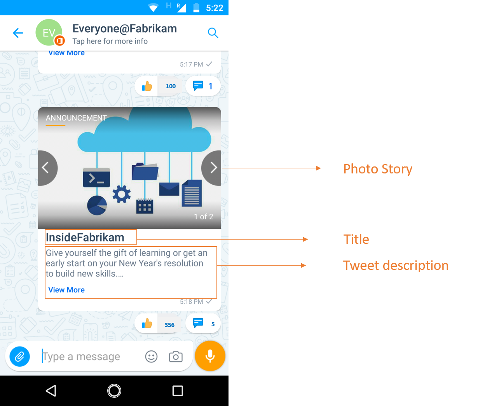
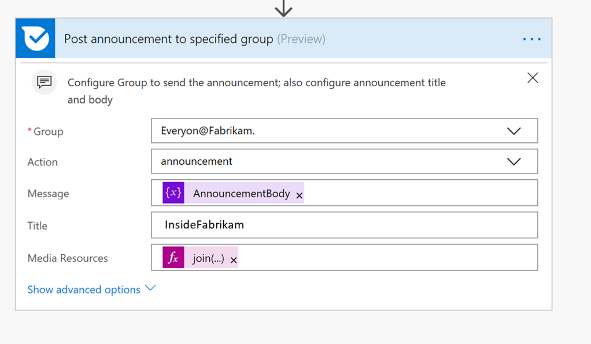

# Auto-Post Twitter updates to Kaizala
Posting to Twitter employee pages is part of daily business, but having to post the same information multiple times is quite difficult. Encouraging employees to share social media updates, when done properly can dramatically expand company's following. 

This sample solution saves your time by auto-posting the status updates from your official twitter account to Kaizala groups. An announcement card is sent to the group when one or all the below triggers occur

	1. A new tweet is posted on a specific twitter handle E.g.,"@InsideFabrikam"

	2. A post is re-tweeted in that twitter handle 
	
	3. A post has a specific hashtag E.g.,"#EmployeeEngagement"

This card has three fields- card title, attachments(images, videos or GIF) and body (description). The announcement body has the twitter URL and on tapping this URL, users would be directed to status page on twitter.

> Note: In case of Video or GIF, thumbnail is shown in chat card view

Chat card View:

Immersive View:

In this scenario, Flow is used to send the card to a selected group in Kaizala.

Kaizala" width="400" />

# Implementation steps:

	1. Download the [AutoPostTwitterUpdatesToKaizala-SolutionPackage.zip](AutoPostTwitterUpdatesToKaizala-SolutionPackage.Zip) (*This contains Flow Package*)

    2.[Import](https://flow.microsoft.com/en-us/blog/import-export-bap-packages/) the "AutoPostTwitterUpdatesToKaizala-SolutionPackage.zip" to your Microsoft Flow account

     > Note- If you have never used Twitter or Kaizala connections, first[add connections](https://docs.microsoft.com/en-us/flow/add-manage-connections)

	3. Edit the Flow (*as Below*)
		1.  In the first block of the Flow
			1. Enter the twitter handle (OR)
			2. Enter the hashtag

Kaizala" width="400" />

		2.  In the last block of the Flow
		    1. Select the group name 
		    2. Enter the title. The title will be visible to users in chat card view. E.g., "InsideFabrikam"
	
Kaizala" width="400" />

	4. Save the flow

Announcement will be sent to the selected Kaizala group, each time Flow is triggered.

 > Note: In case of tweets with polls/location only the poll question/tweet text will show up in the card, not the poll options or the tweet location

 > Note: Please check with your IT admin in case of any [DLP policy](https://docs.microsoft.com/en-us/flow/prevent-data-loss) set by your organization for Twitter
