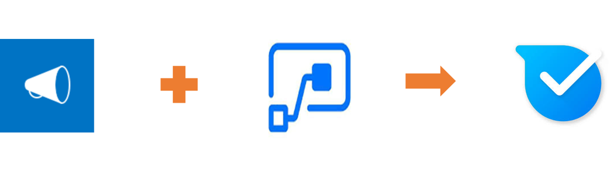

# Display SharePoint Announcements in Kaizala groups 
Organizations use SharePoint Announcement app to share news, status and other short bits of information to employees . Sharepoint Announcement app, that comes with a list, is a special type of list that lets you create announcements.

Using this sample, organizations can share SharePoint announcements with the first line and mobile workers on Kaizala. This card has 3 fields in chat card view- Attachments( In this example, Photo story of images), Title and Announcement body (description). This is sent to a Kaizala group as an out-of-box announcement card.

The chat card view is as below

On tapping the card, immersive view is as below

This scenario can be broadly divided into 2 steps:
1. Create an announcement list with columns- Title, attachments and announcement body(description) 

    > Note: Rich text is not supported by out-of-box announcement card. Switch off rich text for sharepoint column that has Announcement body(description) while creating that column.

    

2. Configure Flow such that, when a new item is created or existing item is modified in announcement list, an out-of-box announcement card is sent to a Kaizala group

    

## Implementation steps

1. [Add Announcement app](https://docs.microsoft.com/en-us/sharepoint/administration/add-apps-for-sharepoint-to-a-sharepoint-site) to SharePoint site(*as below*)
     1. Click on the settings icon
     2.  Click on Add an App 
     3.  Select Announcement App from the list of available Apps
2. Use the [highlighted content web part](https://support.office.com/en-us/article/use-the-highlighted-content-web-part-e34199b0-ff1a-47fb-8f4d-dbcaed329efd) (*if necessary , for visualization*)
3. Download the [SharepointAnnouncementOnKaizala-SolutionPackage.zip](https://github.com/MicrosoftDocs/kaizala-docs/blob/master/Articles/BusinessSolutions/CorporateCommunications/SharepointAnnouncementsonKaizala/SharepointAnnouncementOnKaizala-SolutionPackage.zip) (*This is a Flow package*)
4. [Import](https://flow.microsoft.com/en-us/blog/import-export-bap-packages/) SharepointAnnouncementOnKaizala-SolutionPackage.zip to your Microsoft Flow account
   
   > Note: If you have never used Sharepoint or Kaizala connection, first [add connections](https://docs.microsoft.com/en-us/flow/add-manage-connections)
   
5. Edit the Flow (*as below*)
    1. In the first block of the Flow
    
	     1. Enter the site address
	     2. Enter the List name (*steps to get List name is as below*)
		    - Click on site contents tab on the left hand corner of the screen
		    - Select the announcement list from which you want to send announcements to Kaizala
		    - Click on settings icon at the top right corner of the screen
		    - Go to List settings
		    - Copy the URL of the list from the browser.
		    - Decode the URL (you can decode the URL [here](https://www.url-encode-decode.com/) )
        
	  
    2. In the second block of the Flow
   
        Map "value" field with column title of announcement list, that has announcement body(description) from Dynamic content. In the below example, the column title is "Announcement Body"
        
       
    3. In the last block of the Flow
    
       Select the group name from dropdown. In this Example it is "Everyone@Fabrikam"
       
6. Save the flow

Announcement will be sent to the selected Kaizala group, each time flow is triggered.

> Note: Text file is not supported as attachment
