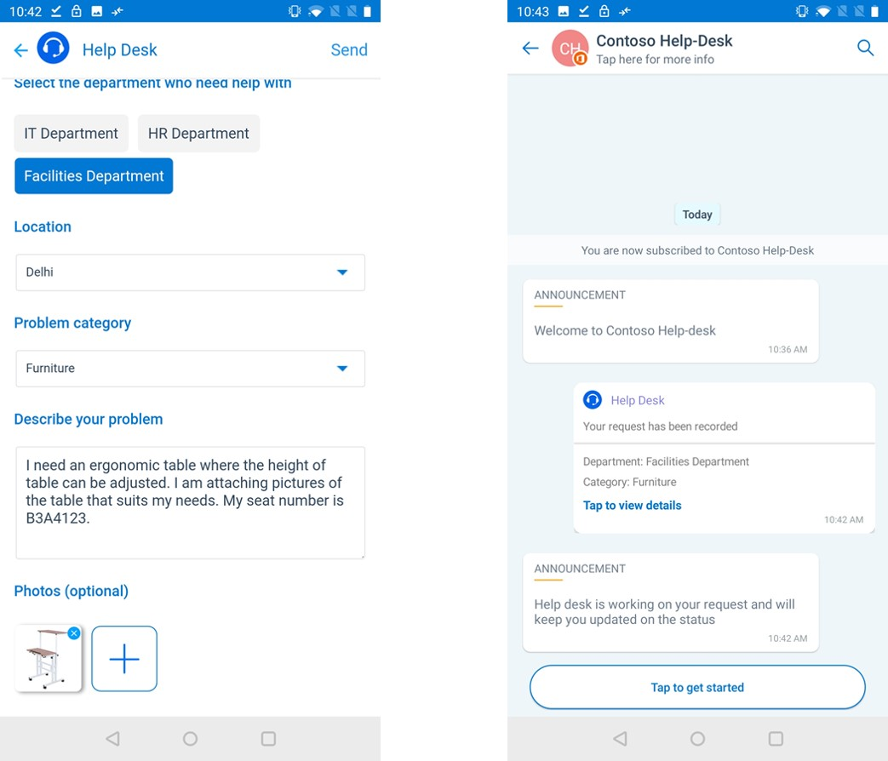
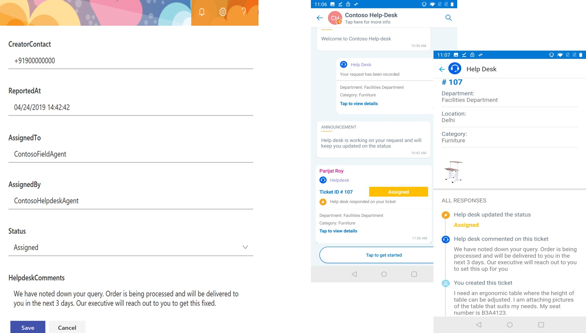
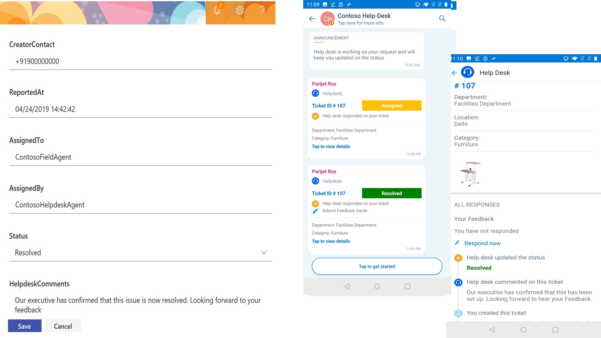
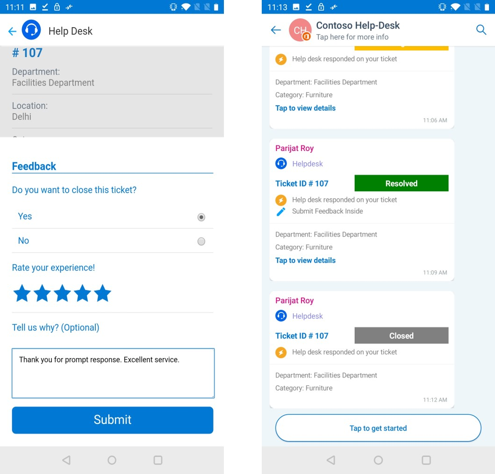
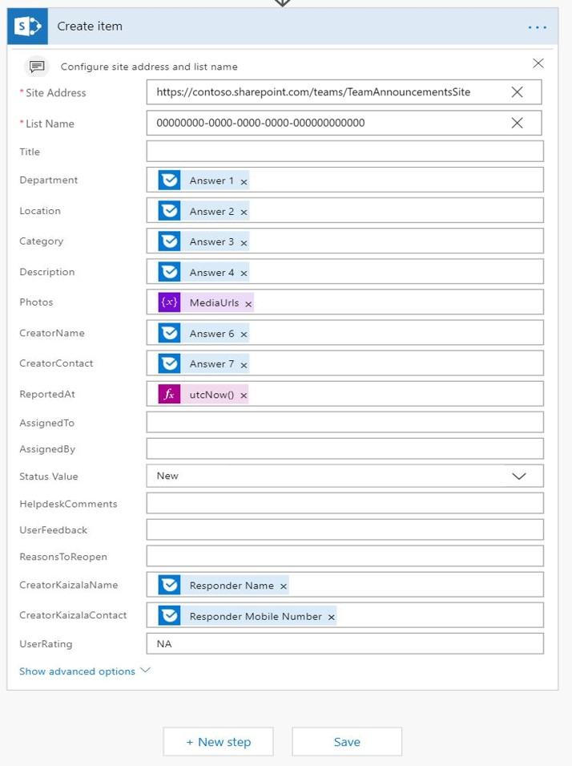
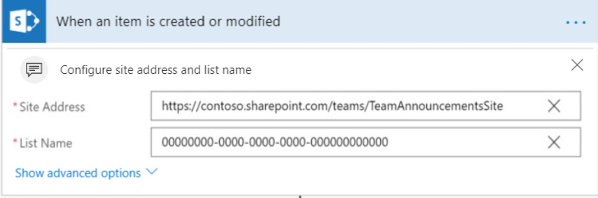
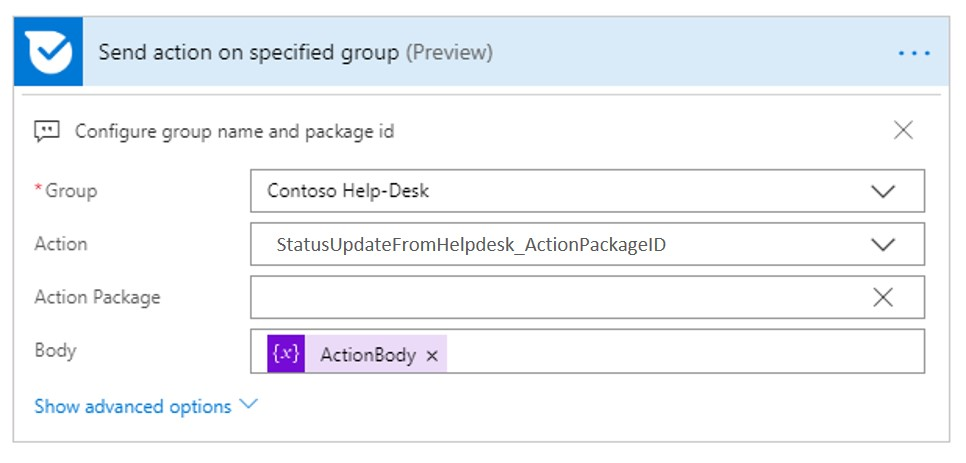
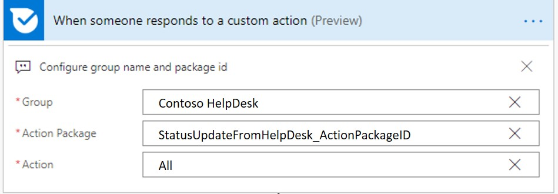
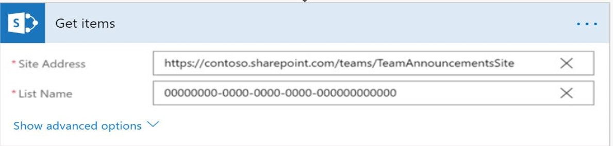
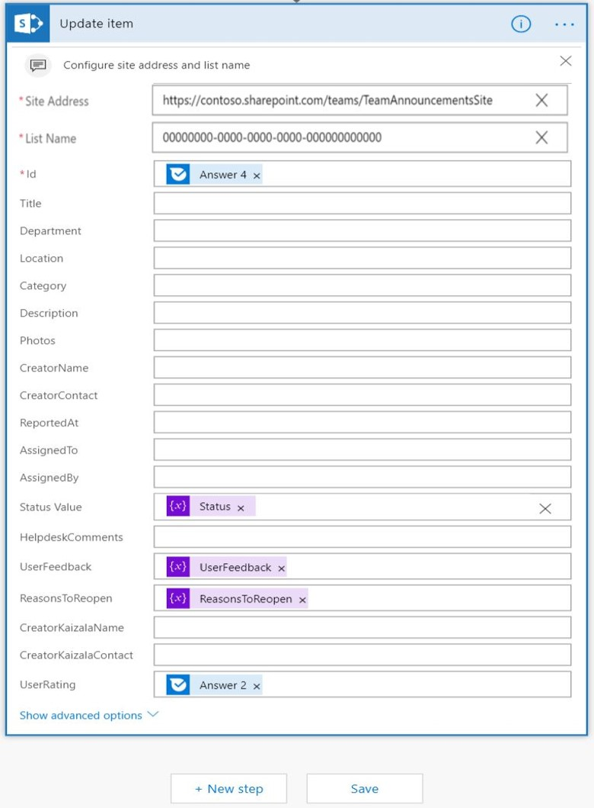

# Employee Help Desk

 In an Organization, helpdesk team looks into the queries raised by employees, assigns it to a field agent and updates back the resolution status to the employee. All the queries are logged in as tickets for easy tracking and resolution. A ticketing system enables helpdesk agents to systematically capture, categorize, resolve and collect feedback. This enables an organization to be effective in query resolution and has a multiplier effect on employee satisfaction scores.

This solution uses Kaizala as the front-end, SharePoint as the backend and Flow as a means to interact with Kaizala and SharePoint. A user creates the ticket by submitting a form in Kaizala, ticket details submitted using this card is captured and stored in the SharePoint using Flow.On submission, User gets an updated card,either when-

   1. Help desk agent updates the status of the ticket in SharePoint (New, Assigned or Resolved) or

   2. Help desk agents adds comments on the ticket in SharePoint or

   3. Both, help desk agent updates status and adds comments in SharePoint

If the user is satisfied with the proposed resolution, user has the ability to close the ticket and submit feedback. If the user is not satisfied with the resolution, user can re-open the ticket. User Feedback - Rating and comments, status- Reopened or closed is updated back in SharePoint.

> Note: This card works only in Hub and spoke groups

  User view of ticket creation and submission:

  

   View on updating the status to "Assigned" in sharepoint and the corresponding card that is sent to user

   

   View of status being updated to "Resolved" in sharepoint and the corresponding card that is sent to user
   
   

   User Feedback view

   

## Implementation Steps:
This is broadly divided into 3 steps:

1. Upload action packages that enable a user to (*2 Action Packages*)

   1. Create and submit a ticket to help desk (*CreateTicket-ActionPackage.Zip*)

   2. Receive status updates & comments from help desk (*StatusUpdateFromHelpdesk-ActionPackage.Zip*)

2. Set up a SharePoint list that enables helpdesk agents to

    1. Store the ticket details

    2. Assign, comment and change the ticket status

3. Configure Microsoft Flow to interact with SharePoint and Kaizala (*3 Flows*)

    1. To collect ticket details from the card and store it in SharePoint(*TicketCreationFlow.Zip*)
    
    2. To send the user an updated card when help desk agent updates the status, comments or both in the SharePoint(*TicketStatusUpdatesFlow.Zip*)

    3. To update the SharePoint list when the user chooses to close, reopen or adds feedback comments from the card(*TicketReopenFlow.Zip*)

### Upload Action Packages
1. Download the ["EmployeeHelpDesk-SolutionPackage.zip"](https://github.com/MicrosoftDocs/kaizala-docs/blob/master/Articles/BusinessSolutions/Life%40Work/EmployeeHelpDesk/EmployeeHelpdesk-SolutionPackage.zip) (*This contains 2 Action Packages and 3 Flows*)

2. Download the latest version of Kaizala ["ActionSDK.Zip"](https://manage.kaiza.la/MiniApps/DownloadSDK) (*This contains KASClient.js*)

3. Set up the "CreateTicket-ActionPackage.Zip"

   1. Unzip "CreateTicket-ActionPackage.Zip" to a folder

   2. Change the action "id" and "provider name" in package.json

   3. Add KASClient.js to this folder 

   4. Zip all the contents in this folder (*This folder is your modified action package which should be imported to Kaizala Management Portal*)

   5. [Import](https://docs.microsoft.com/en-us/kaizala/actions/publish#import-kaizala-action) the edited action package to [Kaizala Management Portal](https://manage.kaiza.la/)

   6. [Publish](https://docs.microsoft.com/en-us/kaizala/actions/publish) the action and add the action to a group where you want to add the card

   7. Select user roles as admin and member

4. Set up "StatusUpdateFromHelpDesk-ActionPackage.Zip"

   1.  Unzip "StatusUpdateFromHelpDesk-ActionPackage.Zip" to a folder

   2. Change the action "id" and "provider name" in package.json

   3. Add KASClient.js to this folder 

   4. Zip all the contents in this folder (*This folder is your modified action package which should be imported to Kaizala Management Portal*)

   5. [Import](https://docs.microsoft.com/en-us/kaizala/actions/publish#import-kaizala-action) the edited action package to [Kaizala Management Portal](https://manage.kaiza.la/)

   6. [Publish](https://docs.microsoft.com/en-us/kaizala/actions/publish) the action and add the action to a group where you want to add the card

   7. Select user role as admin

       > Note: "CreateTicket-ActionPackage.Zip" is the card that is used to raise a ticket and should be made available to admin and Subscribers."StatusUpdateFromHelpDesk-ActionPackage.Zip" show helpdesk comments and status updates. Subscribers do not have to see this card in action palette, hence this is only made visible to admin.

### Set up a SharePoint List

1. [Create](https://support.office.com/en-us/article/create-a-list-in-sharepoint-0d397414-d95f-41eb-addd-5e6eff41b083) a new list in SharePoint

2. [Add](https://support.office.com/en-us/article/create-a-column-in-a-sharepoint-list-or-library-2b0361ae-1bd3-41a3-8329-269e5f81cfa2) columns and [Edit](https://support.office.com/en-us/article/Edit-list-settings-in-SharePoint-Online-4d35793b-246e-42a3-990c-563a83795b7f) (*as below in the same order and format*) column settings for this list

    Column
    Recommended settings
    |-------- |---|
     Department|Single line of text
     Location|Single line of text
     Category|Single line of text
     Description |Multiple lines of text
     Photos|Multiple lines of text
     CreatorName|Single line of text
     CreatorContact|Single line of text
     ReportedAt|Single line of text
     AssignedTo|Single line of text
     AssignedBy|Single line of text
     Status|Choice with options as New, Assigned, Resolved, Closed and Reopened (*These ticket stages are mandatory*)
     HelpdeskComments|Multiple lines of text
     UserFeedback|Multiple lines of text
     ReasonsToReopen|Multiple lines of text
     CreatorKaizalaName|Single line of text
     CreatorKaizalaContact|Single line of text
     UserRating|Single line of text
 

4. [Edit list view](https://support.office.com/en-gb/article/edit-a-list-view-in-sharepoint-online-15916903-e79a-423f-b4e2-02d37e1ff372) to position ID in first place.This is the unique ticket ID that will be displayed in the card, once the ticket is assigned.

     >Note: [Download](https://github.com/MicrosoftDocs/kaizala-docs/blob/master/Articles/BusinessSolutions/Life%40Work/EmployeeHelpDesk/HelpdeskTemplate.xlsx) excel template for column headers

### Import and Set up Flows

This solution has 3 Flows,

1. To collect ticket details from the card and store it in SharePoint

    1. [Import](https://flow.microsoft.com/en-us/blog/import-export-bap-packages/) the "TicketCreationFlow.Zip" to your Microsoft Flow account

          > Note- If you have never used Sharepoint or Kaizala connections, first [add connections](https://docs.microsoft.com/en-us/flow/add-manage-connections)    

    2. Edit details in Imported Flow (*See steps below*) 

          1. In the First block 

               1. Enter the Group ID or Select the Group name where you want to add the card

               2. Click on Action Package field to enter action id that you have given for "CreateTicket-ActionPackage.zip"

               3. Map action to "All"

                  

          2. In the Last block

               1. Enter the SharePoint Site address

               2. Enter List Name
                  
                  

                   > Note: All the columns in the SharePoint list will be displayed in Flow on entering Sharepoint Site address & List Name. Verify the mapping of SharePoint list fields in Flow. 

          3.  Save the Flow
           

2. To send the user an updated card when help desk agent updates the status, comments or both in the SharePoint

    1. [Import](https://flow.microsoft.com/en-us/blog/import-export-bap-packages/) the "TicketStatusUpdatesFlow.Zip" to your Microsoft Flow account

    2. Edit details in Imported Flow (*See steps below*) 

          1. In the first block

               1.  Enter the SharePoint Site address

               2. Enter List Name

                  

          2. In the last block

               1. Enter the group ID or select group name to where you want to send the status updates

               2. Click on Action to select "Action Package" 

               3. Click on Action package to enter action id that you have given for "StatusUpdateFromHelpDesk-ActionPackage.Zip"

               4. Map body to "ActionBody"

                  

        3.  Save the Flow
    
3. To update the SharePoint list when the user chooses to close, reopen or adds feedback comments from the card
 
    1. [Import](https://flow.microsoft.com/en-us/blog/import-export-bap-packages/) the "TicketReopenFlow.Zip" to your Microsoft Flow account

    2. Edit details in Imported Flow (*See steps below*) 

        1. In the First block 

             1. Select group name or enter the group ID

             2. Click on action package to enter action id that you have given for "StatusUpdateFromHelpDesk-ActionPackage.Zip"

             3. Map action to "All"

                

        2. In the second block

             1. Enter the site address

             2. Enter the list name 

                

        3. In the Last block

             1. Enter the site address

             2. Enter the list name

                

        4.  Save the Flow
