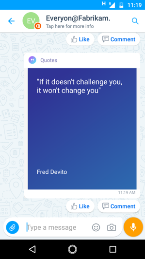

# Share Inspirational Quotes

Every leader likes to inspire workforce and sometimes the inspiration that is needed to guide a team comes from simple words of wisdom.A few words of wisdom with teams can have a dynamic impact on employee morale and performance. 

Organizations can use this card to share inspirational quotes on a regular basis and not just limit to roadshows, meeting rooms and email.Users can Pick from five colorful backgrounds or share image quotes in a group. Users may also choose to write a message along with the quote. 

> Note: This card is optimised for portrait images 

This is a simple card with creation view, chart card view and immersive view.

Creation view:

Chat card View:

Immersive View:

## Implementation Steps:
1. Download the ["ShareQuotesOnKaizala-SolutionPackage.zip"](https://github.com/MicrosoftDocs/kaizala-docs/tree/master/Articles/BusinessSolutions/Life%40Work/InspirationalQuotes%40Workplace) (*This contains action package*)
2. Download the latest version of Kaizala ["ActionSDK.Zip"](https://manage.kaiza.la/MiniApps/DownloadSDK) (*This contains KASClient.js*)
3. Edit the "ShareQuotesOnKaizala-SolutionPackage.Zip" (*as below*)
   1. Unzip "ShareQuotesOnKaizala-SolutionPackage.Zip" to a folder
   2. Change the action "id" and "provider name" in package.json
   3. Add KASClient.js to this folder 
   4. Add html2canvas.min.js from https://html2canvas.hertzen.com/ to this folder.
   5. Zip all the contents in this folder (*This folder is your modified action package which should be imported to kaizala management portal*)	
       
> Note:Select all the files in your working directory and create a new zip file for your package. Ensure that all files are present in the root directory of the package. This should include KAS client, package.Json with new action "id" and "provider name". Also, Please refer to license guide of html2canvas.min.js and comply with their terms and conditions before adding html2canvas.min.js to your  action package and uploading it to your tenant
       
4. [Import](https://docs.microsoft.com/en-us/kaizala/actions/publish#import-kaizala-action) the edited action package to [kaizala management portal](https://manage.kaiza.la/)
5. [Publish](https://docs.microsoft.com/en-us/kaizala/actions/publish) the action and add the action to a group where you want to add the card
6. Select user roles as admin and member to send the card in flat groups and managed public groups

> Note: In a flat group, all the group members and admins can create and send this card. In managed Public group, only admin and member role users can send this card, while subscribers would recieve the card.

Here are few Quotes from famous personalities that will help you to start:

 1. We are what we repeatedly do. Excellence then, is not an act, but a habit. – Aristotle
 2. There are no secrets to success. It is the result of preparation, hard work, and learning from failure. – Colin Powell
 3. The mind is everything. What you think you become. – Buddha
 4. Example is not the main thing in influencing others. It is the only thing- Albert Schweitzer
 5. Always bear in mind that your own resolution to succeed is more important than any other- Abraham Lincoln

## Useful Links

[Groups in Kaizala](https://docs.microsoft.com/en-us/kaizala/partnerdocs/groupsinkaizala)
