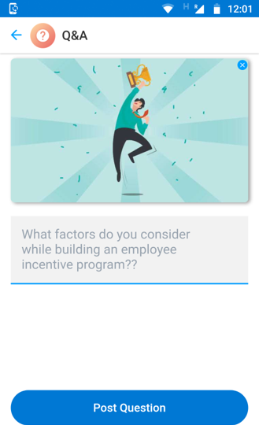
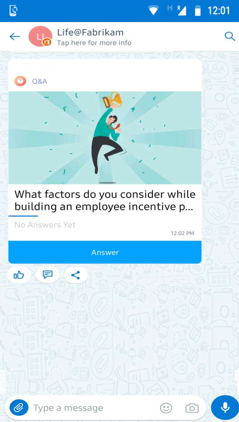
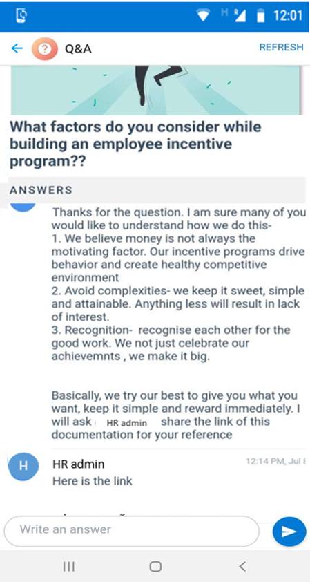

# Get structured answers to your questions from co-workers

Group chats can be confusing at times, especially if it is a large community that talks at the same time. The replies to questions can interrupt the flow and end-user would miss out on information, especially if the questions are related to company policies, goals, projects to name a few.

With QnA card, users can ask questions to rest of the community and view all the replies in a structured format.

This is a simple card with a creation view, that allows the user can submit the question, a chart card view that allows the users to see the latest comments and summary view where the users can view and participate in the discussion.

Creation view:

Chat card View:

Summary View:

## Implementation Steps:
1. Download the ["QnA-SolutionPackage.zip"](https://github.com/MicrosoftDocs/kaizala-docs/blob/master/Articles/BusinessSolutions/Life%40Work/InspirationalQuotes%40Workplace/ShareQuotesOnKaizala-SolutionPackage.zip) (*This contains action package*)
2. Download the latest version of Kaizala ["ActionSDK.Zip"](https://manage.kaiza.la/MiniApps/DownloadSDK) (*This contains KASClient.js*)
3. Edit the "QnA-SolutionPackage.Zip" (*as below*)
   1. Unzip "QnA-SolutionPackage.Zip" to a folder
   2. Change the Action "id" and "providerName" in package.json
   3. Add KASClient.js to this folder (*rename the KASClient(1).js to KASClient.js if required*)
   4. Zip all the contents in this folder (*This folder is your modified action package which should be imported to kaizala management portal*)    
       
      > Note: Select all the files in your working directory and create a new zip file for your package. Ensure that all files are present in the root directory of the package. This should include  KASClient.js, package.json with new action "id" and "providerName".
       
4. [Import](https://docs.microsoft.com/en-us/kaizala/actions/publish#import-kaizala-action) the edited action package to [kaizala management portal](https://manage.kaiza.la/)
5. [Publish](https://docs.microsoft.com/en-us/kaizala/actions/publish) the action and add the action to a group where you want to add the card
6. Select user roles as admin and member to publish the card in the flat group

> Note: This card works only in Flat group. All the group members and admins can create and send this card in a flat group.