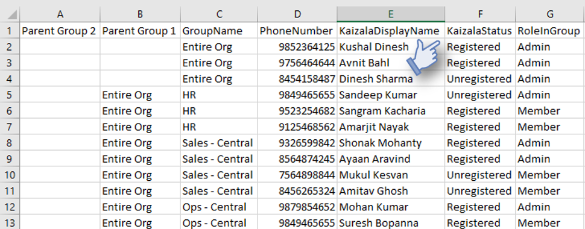

# Getting Started with Microsoft Kaizala
## A Quick Reference Guide 
###### Welcome, we’re glad you’re here! This quick reference guide will help you to get your organization started on Kaizala. 

###### The Kaizala user guide is available [here][1] and the guide for the Kaizala Management Portal that enables you to manage Kaizala groups, do bulk provisioning, and get reports of all Kaizala activity is available [here][2].
[1]: https://support.office.com/en-us/article/About-the-Kaizala-mobile-app-122fdf32-9f15-465d-a905-6fae72d38b42
[2]: https://support.office.com/en-us/article/About-Kaizala-Management-Portal-2046ddba-06fb-49c9-b6d6-a4777e8a556f?ui=en-US&rs=en-US&ad=US
[3]: https://play.google.com/store/apps/details?id=com.microsoft.mobile.polymer&hl=en
[4]: https://itunes.apple.com/in/app/microsoft-kaizala/id1112208399?mt=8
[5]: http://manage.kaiza.la/
[6]: https://support.office.com/en-us/article/Kaizala-Groups-858bead0-f99b-4215-83c6-b8812bbe3edd
[7]: https://github.com/MicrosoftDocs/kaizala-docs
# 1. Installation and quick start 
###### Download Kaizala from [Google Play Store][3] for Android or [App Store][4] for iOS now. Activate with your phone number and get started right away. Click on the ‘+’ sign to create a group and add members from your contacts list or directly add the phone numbers. Give the group a name and you are all set. Try sending a Kaizala Action by clicking on the top right corner to bring up the Kaizala Actions palette. Try sending a Quick Poll or an Announcement to see Kaizala in Action. If you don’t have anyone in your network on Kaizala, you can still add them to the group and then click on Group Name to send an invite to all the members who are not on Kaizala. 
# 2.	Identify scenarios 
###### It is advisable to have a few use cases for Kaizala in mind for your organization before you begin the deployment. Here are some videos depicting Kaizala use cases, created with inspiration from real customers using Kaizala.

###### Here are some more sample use cases listed for your reference to get you started with your planning.
| Scenario   |      Some Use Cases      |  Sample Illustration|
|----------|:-------------:|------:|
|**Keep your employees informed and engaged**|Use the Announcement card in Kaizala to: 
 •	Send a Welcome announcement to all employees. 
•	Inform all employees about a new policy.
&nbsp;&nbsp;&nbsp;&nbsp;&nbsp;&nbsp; o	Employees can provide their inputs or ask questions using Comments section of the Announcement. They can just “Like” the announcement.
•	Update the entire Sales team about the latest product launch and new targets.
&nbsp;&nbsp;&nbsp;&nbsp;&nbsp;&nbsp; o	Employees can ask clarifying questions in Comments section.
•	Announce a sudden holiday or a re-organization in the team
&nbsp;&nbsp;&nbsp;&nbsp;&nbsp;&nbsp; o	Employees will use “Likes” for sure. 😊 ||
|**Data collection from field and effective work management for your team**|Use Kaizala Surveys and Polls to quickly collect data from field employees and use other Actions to manage work.
 •	Get customer leads data while team is in the field.
&nbsp;&nbsp;&nbsp;&nbsp;&nbsp;&nbsp;o	Sales team can enter customer information while on the go.
&nbsp;&nbsp;&nbsp;&nbsp;&nbsp;&nbsp;o	Customer leads can automatically get into backend CRM using Kaizala APIs.
&nbsp;&nbsp;&nbsp;&nbsp;&nbsp;&nbsp;o	Report of this is available on the Kaizala Management Portal, in real time.
•	Get daily status report from remote locations, along with photo and location of the remote site.
•	Assign tasks to team in Kaizala and review status and trend in the Kaizala Management Portal.
•	Invite people for meetings using Kaizala.||
|**Connect with your customers and value chain;Get feedback instantly**|•	Use Kaizala public groups to create a private channel of communication with your lakhs of customer or citizens:
&nbsp;&nbsp;&nbsp;&nbsp;&nbsp;&nbsp;o	Send them marketing content about new launch.
o	Send surveys to them to get feedback on new launch.
o	Create custom Kaizala cards for them to open a support request.
o	View  report of all of this on the Kaizala Management Portal.
•	Use managed public group to only add pre-defined members to a public group like all parents groups for schools or all dealers or vendors you work with.||
|**Develop your LoB apps on Kaizala as Kaizala Custom Actions, available within the app**|You can create customized applications for your organization like leave application or attendance tracking using the Kaizala Extensibility Framework. These apps will show up in the Kaizala Action palette.||  
# 3.Define groups in Kaizala for your org   
###### Once you have identified the use cases for Kaizala in your org, you need to create the right groups in Kaizala so that those use cases can be achieved effectively.

###### Kaizala provides 3 types of groups that can be used in isolation or in conjunction to support the various communication and collaboration needs of your organization – within its employees as well as with its value chain or employees.  
###### Here are the types of groups, their properties, and commonly used scenarios where each of the group type is used by our existing customers: 
| Group Type   |      Properties     |  Commonly Used Scenarios|
|----------|:-------------:|------:|
|**Flat**|•	Standard messaging groups where you can add thousands of users.
•	You can add users using phone numbers; saving as contact is not needed
•	You can create and assign Kaizala Actions (like Job, Survey, Poll, etc.) to any participant of the group.
•	Phone numbers of group members are only visible to admin; unless member is already in your contacts.| 1.	Small team groups
 2.	Project team group
 3.	Leadership team group
 4.	Your work friends/family group| 
|**Hierarchica**|•	Groups can have direct members as well as subgroups as members.
•	Message sent at any level goes to all members in that group and down to all its child groups. Hence, members in parent group cannot send text messages; they can only send an Announcement card since those messages are sent to all its child groups.
•	Any group member can create and assign Kaizala Actions (like Job, Survey, Poll, etc.) to anyone in the same group or below it.
•	Child groups cannot send message to parent group or peer groups.
•	Bottom groups (leaf nodes) of the hierarchical groups are regular flat groups.  |1.	You can create geographical groups mapping to districts and state level org units.
2.	You can create business groups headed by the parent group for CEO/all org. E.g. HR, Finance, Ops, etc. under ORG group. Each of these can have regional groups like North Sales, South Sales, etc.
3.	College groups with each subject/dept. group mapping to a college level parent group.
4.	Apartment community group with each building/tower representing a child group.| 
|**Public**|•	Admin can connect with any number of members and send and seek information.
•	These members cannot see each other or interact with each other.•	These members can communicate with admin only through admin-defined custom cards like Give Feedback, Share your requirement, etc.
•	Members can subscribe to a public group using a link.|1.	Government agencies can create a public group to connect with citizens.
2.	Enterprises can create a public group to connect with customers.
Enterprises can also create a managed public group to connect with their vendors, suppliers, retailers, etc.; in this case, only pre-defined members can join the group.|
## 3.1 Create groups and add users  
###### Once you have identified the group types and structure for your organization, you can either create groups directly using the app or you can use the Kaizala Management Portal to create groups and add users in Bulk using Excel.

###### You can create a group using the ‘+’ sign and add members to that group. If you want to add child groups, you can do that on the same screen where you are adding members – just select Groups instead of Contacts and all existing groups on your phone will show up. You will have to create the individual child groups first and then add them to the parent group.

###### Here are quick instructions on how to create these groups using the portal:
 
###### 1.	Login on [Kaizala Management Portal][5] with your Office 365 credentials or Kaizala Pro credentials.

###### 2.	Click on Upload CSV file under Add users in Bulk.
###### 3.	Download Excel templates and add mobile numbers and hierarchy information, if any.  
###### 4.	Browse and add both the files and click on Submit.
###### 5.	Once you see the information on the screen, click on Upload.
###### 6.	If you want to create public groups, click on Public Group from the left menu and go through Create flow.
###### For detailed instructions on creating groups and adding members to it, please refer [here.][6]  
# 4. Start using Kaizala
###### Kaizala can be installed from [Google Play Store][3] for Android or [App Store][4] for iPhones.
## 4.1 Get Kaizala installed by your organizational users
###### Driving app installation in your org would be very critical to the success of this project. Here are some methods used by other customers:
###### &nbsp;&nbsp;&nbsp;&nbsp;&nbsp;&nbsp; •	Click on Group name in Kaizala app and click on Invite All to send a text message to invite all members.
###### &nbsp;&nbsp;&nbsp;&nbsp;&nbsp;&nbsp; •	Send out an email to people sharing value prop and a link to download.
###### &nbsp;&nbsp;&nbsp;&nbsp;&nbsp;&nbsp; •	Send out messages to the organizational WhatsApp groups with the download link.   
###### &nbsp;&nbsp;&nbsp;&nbsp;&nbsp;&nbsp; •	Send out bulk SMSs to people with the download link. 
###### &nbsp;&nbsp;&nbsp;&nbsp;&nbsp;&nbsp; •	Design Kaizala posters and place them at places where everyone can see it.
###### &nbsp;&nbsp;&nbsp;&nbsp;&nbsp;&nbsp; •	Incentivize people to install Kaizala with early bird winner or with quizzes or best picture submission survey, etc.
## 4.2 Find users who have installed Kaizala / User activation data
###### From the Kaizala Management Portal, you can download a CSV file that shows the status of Kaizala for each user.
###### &nbsp;&nbsp;&nbsp;&nbsp;&nbsp;&nbsp;1.	Login on [Kaizala Management Portal][5] with your Office 365 credentials or Kaizala Pro credentials.  
###### &nbsp;&nbsp;&nbsp;&nbsp;&nbsp;&nbsp;2.	Click on Groups tab on the left and click on your group name.  
###### &nbsp;&nbsp;&nbsp;&nbsp;&nbsp;&nbsp;3.	You can see the members Registered or Unregistered (have not installed Kaizala). You can also use the Export users > Initiate new request > Download option to get these details in a CSV file.   
  
## 4.3 Find whether users are using Kaizala / Kaizala usage data
###### You can monitor whether users are using Kaizala using the Kaizala Management Portal.
###### &nbsp;&nbsp;&nbsp;&nbsp;&nbsp;&nbsp;1.	Login on [Kaizala Management Portal][5] with your Office 365 credentials or Kaizala Pro credentials.  
###### &nbsp;&nbsp;&nbsp;&nbsp;&nbsp;&nbsp;2.	Click on Groups tab on the left and click on your group name.  
###### &nbsp;&nbsp;&nbsp;&nbsp;&nbsp;&nbsp;3.	You can click on Reports on the left pane and click on Usage Telemetry to monitor usage of Kaizala in your groups.   
 
## 4.4 Send your first message
|*Publish a Welcome Announcement* 
 You can send out a Welcome message to all the users in your organization to get them started on Kaizala.
Send this message from the top group as an Announcement. Add picture or audio to make it more engaging.
Incept people to write some Comments or Like the announcement to get the engagement started.| ||
|-----------|:-------------:|------:|
|*Publish a Poll* 
 Send a Quick Poll to start engaging with your users. 
Open the group from which you want to send this out. If you want to send to all employees, send from Top group.
Just click on the Action icon on the top right and click on Quick Poll. Take an opinion poll on something which is dear to many. If you can make a decision or take action based on that – even better! Word of mouth will spread and people will download more willingly. |||
###### Once you have a critical mass of your organization using Kaizala, you can evaluate creating/migrating your custom/LoB apps on Kaizala or integrating Kaizala data to your existing DB or workflows using the [Kaizala Developer Platform.][7]
# Contact Us
###### &nbsp;&nbsp;&nbsp;&nbsp;&nbsp;&nbsp;1.	Send email to [KaizalaFeedback@microsoft.com][8] for any questions or suggestions.   
###### &nbsp;&nbsp;&nbsp;&nbsp;&nbsp;&nbsp;2.	Or, join Team Kaizala public group on Kaizala to get latest updates about Kaizala and provide your feedback/suggestions. [Kaizala > Discover > Subscribe to “Team Kaizala” > Share Feedback]. 
