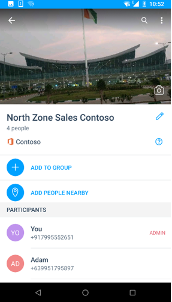
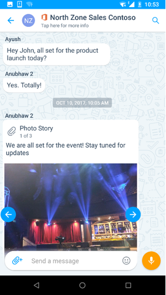
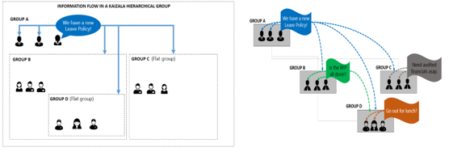
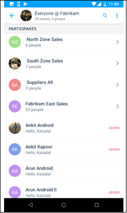
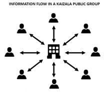
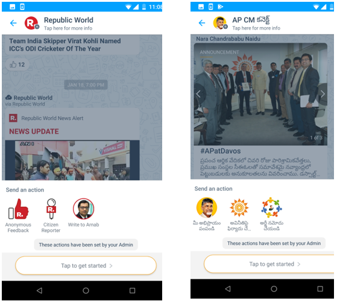

# Groups in Kaizala
In Kaizala, you can add or invite people to join the group even if they are not yet on Kaizala. As soon as they install Kaizala, they will see that they are already added to the group. 

Kaizala has three types of groups to cater to different types of organizational requirements:
- Flat Groups
- Hierarchical Groups
- Public Groups

## **Flat Groups**

Flat groups usually suits to small team, project team, leadership team, and Work/family team groups. 

Some main properties of Flat group includes:

- Standard messaging groups where you can add thousands of users.
- You can add users using phone numbers, saving a contact first is not mandatory.
- You can create and assign Kaizala Actions like (Job, Survey, Poll, etc.) to any participant of the group. 
- Phone numbers of group members are only visible to admin; unless member is already in the contacts  
 &nbsp;&nbsp;&nbsp;&nbsp;&nbsp;&nbsp;&nbsp; 

## **Hierarchical Groups**

Most organizations in real world are not flat but hierarchical, and hence Kaizala provides a way to map your organizational hierarchy to chat platform.

Unlike a flat group where all the information shared is visible to everyone in the group, in hierarchical group, information flows from the top to the bottom. There exists a parent-child relationship between the groups. 

For example, when you add Sales group to Head Office group (group A in images), Sales Group (group B in images) becomes the sub-group of Head Office group. Members of Sales group will start seeing a Head Office in their Kaizala Client chat list. In group Head office, they can only view/respond to Actions sent in Head Office. They would not be able to send messages in this group.

Similarly, when North Sales (group D in images) is added to Sales Group, refer the table below to understand the relationship.

|Message Sending Group|Message Recieving Group|
|--------|--------|
|Messages sent in Head Office|Members of Sales Group and North Sales Group receives the message in group named Head Office in the chat list|
|Messages sent in Sales Group|Members of North Sales Group receives the message in Sales group in the chat list|
|Messages sent in North Sales Group |Only North Sales group receives the message|

  

Hierarchical groups are mainly used to share information with your entire organization or collect data from your organization. 

Consider the following examples.

- In a public-sector organization spread deep in a state, you can create geographical groups mapping to districts, mandals/constituencies, and state level organization units.
-	In a business organization, you can create business groups headed by the parent group for CEO or HR, Finance, Operations Heads. Each of these groups can have regional child groups such as, like North Sales Department, South Sales department, and so on.
-	In education institutions, you can create groups with departmental groups as child groups, having each year’s student batch as child groups.
-	In a Apartment community, you can create groups with each building/tower representing a child group.

Some main properties of this type of group include: 
- Groups can have direct members as well as subgroups as members.
- Message sent at any level goes to all members of that group and down to all its child groups. Hence, chat is disabled in parents groups but all Kaizala Actions are enabled. So, members of parent groups can send Announcements or Surveys which will be sent to entire organization.
- Any group member can create and assign Kaizala Actions like (Job, Survey, Poll, etc.) to anyone in the same group or below it.
- Child groups cannot send the message to a parent group or peer groups but they can present their views through Likes and Comments on each Kaizala Action sent to them.
- Bottom groups (leaf nodes) of the hierarchical groups are regular flat groups.
  

## **Public Groups** 

A Public Group in Kaizala is a unique group where members of the group can interact with the admin of the group on a one-to-one basis, but the interactions cannot be seen by other group members. 

Public groups are usually preferred in the following scenarios:

- Government agencies who want to connect with citizens.
- Enterprises can connect with customers.
- Enterprises can also create managed public group to connect with their vendors, suppliers, retailers, and so on.

In Public Groups, only pre-defined members can join the group.

Some main properties of this kind of group include: 

- Admin can connect with any number of members and send and seek information.
- The members cannot see each other or interact with each other.
- The members can communicate with admin only through admin defined custom cards like giving Feedback, Share your requirement, etc.
- Members can subscribe to a public group using a link.
    

