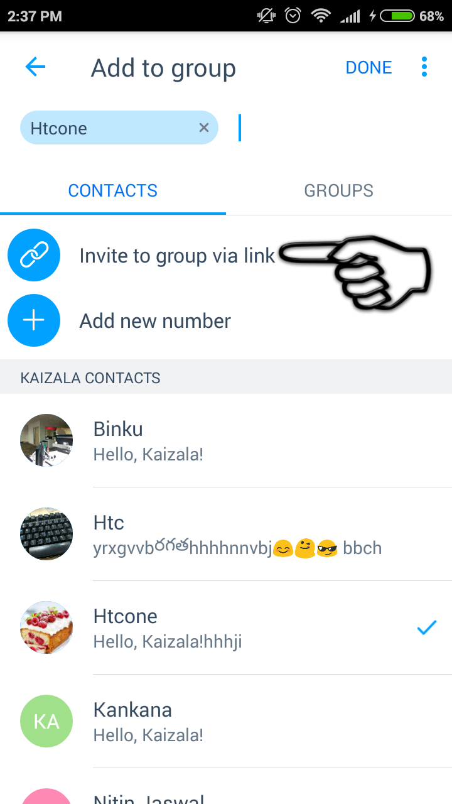
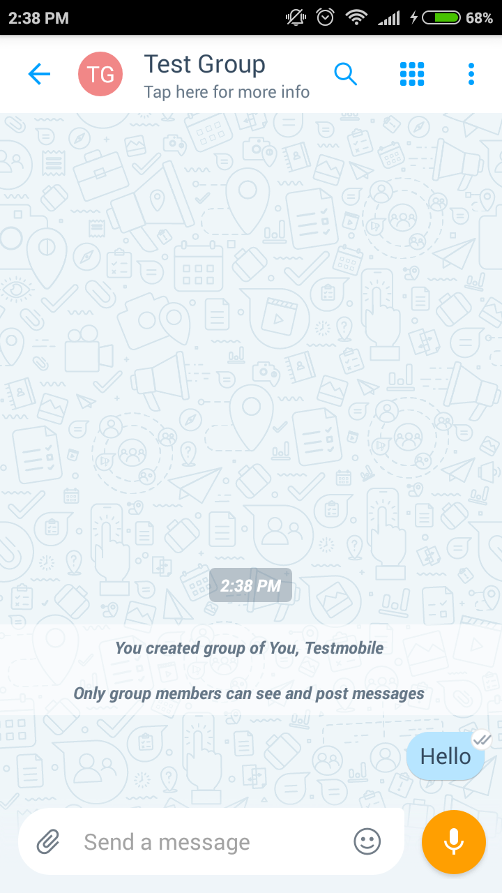

[3]: https://play.google.com/store/apps/details?id=com.microsoft.mobile.polymer&hl=en
[4]: https://itunes.apple.com/in/app/microsoft-kaizala/id1112208399?mt=8

# Installation and quick start 
###### Download Kaizala from [Google Play Store][3] for Android or [App Store][4] for iOS now.

### Activate with your phone number and get started right away 

1. Click on the ‘+’ sign to create a group and add members from your contacts list or directly add the phone numbers. Give the group a name and you are all set. 

 
2.  To invite the people not on Kaizala to this group, just share the "Link to the Group".

3.  Say "Hello" in the group.

4. Send a Kaizala Action by clicking on the top right corner to bring up the Kaizala Actions palette. Try sending a Quick Poll or an Announcement to see Kaizala in Action.

 

