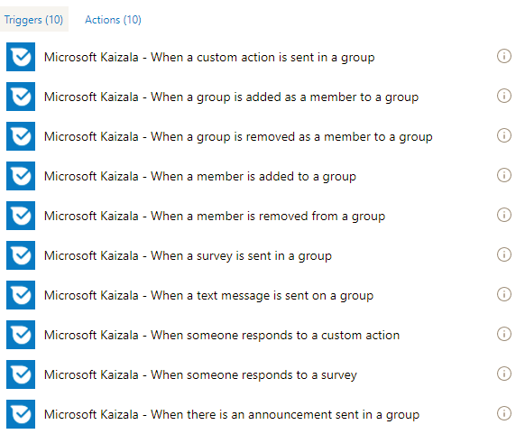
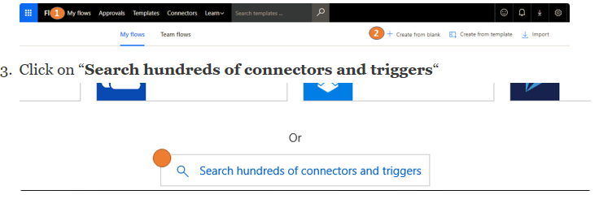
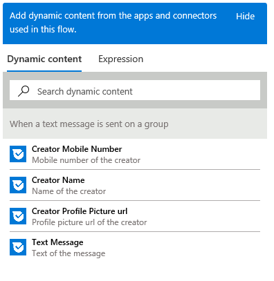
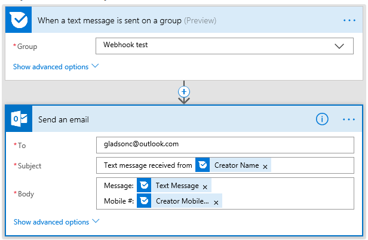
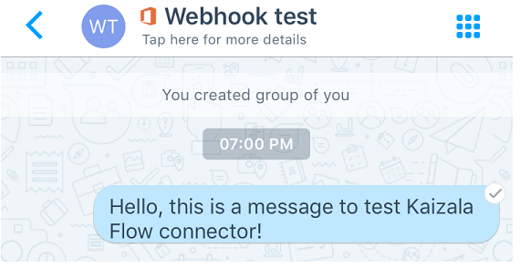
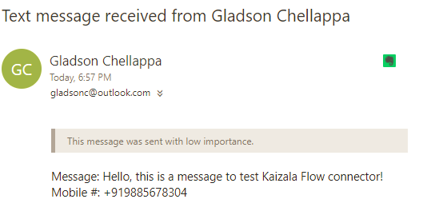

# Automating business process using Kaizala Flow connector
## Introduction to Microsoft Flow
Microsoft Flow is a service that helps you create automated workflows between your favorite apps and services to synchronize files, get notifications, collect data, and more. [courtesy: [Flow](https://docs.microsoft.com/en-us/flow/getting-started)]. In some sense, you could just build a flow chart that would run the logic behind the scenes – that simple!
  Flow abstracts out services as connectors which serve as a proxy / wrapper around the underlying service. Flow communicates with the connector(s) and enables you to pass output from one connector to another.  This allows you to build a Flow integrating with multiple services. A connector could have triggers and actions. Triggers are the event that trigger a flow. Every flow starts with a trigger. Example of a trigger: When an email is received. Actions are the functionalities that the services exposes. Example of an action: Send an email. When you add a connector on Flow, if the connector requires an underlying account for accessing the service / functionality – you will need to authenticate / configure the account before you can use the connector. This information gets saved as a connection.
  If your service is not available on Flow yet, you could create a Custom Flow connector for your service!
## Kaizala Flow connector
Kaizala is available as a connector on Microsoft Flow. This allows you to incorporate Kaizala in your business workflow. And, since Flow supports 200+ connectors – which presents an opportunity to build Kaizala solutions with them.
  Below are screenshots showing the list of currently available triggers and actions in the Kaizala Flow connector.
### Actions

### Triggers

 
  Kaizala has 2 Flow templates published that you could use as a starting point:
  1. [Add a SharePoint list item for every Kaizala survey response](https://us.flow.microsoft.com/en-us/galleries/public/templates/a71f0ac3e35a40728b3e9ee27bf9dbcd/add-a-sharepoint-list-item-for-every-kaizala-survey-response/)
  2. [Send an announcement on Kaizala when you get an Outlook email](https://us.flow.microsoft.com/en-us/galleries/public/templates/cb85f664dfb0421dbd937dd64618f791/send-an-announcement-on-kaizala-when-you-get-an-outlook-email/)
## Example scenario
To demonstrate Kaizala Flow connector, let us think of a scenario : “Email the text message received on Kaizala group”.
### Steps:
  1. Go to [https://flow.microsoft.com](https://flow.microsoft.com/en-us/) and sign in with your credentials
  2. Click on “My flows” and subsequently click on “Create from blank”

  4. Give a name for your flow
  5. In the connector search box, search for Kaizala
  6. Select the Kaizala Flow connector from the search result
   7. From the available triggers, select “When a text message is sent on a group” (you will need to authenticate to Kaizala at this point with your mobile number and OTP that you will receive)
   8. Now add an action to send email (I have chosen Outlook.com – Send an email action – you will need to authenticate to your email account)
  9. Enter an email address in the To field
 10. Click on the Subject field – you will notice a pop-up on the right that gives you a bunch of values fetched from the trigger above
 
  11. Let us have the sender’s name in the subject and the message, mobile number in the body of the email. Then flow looks like this:
 

  12. Click on Create flow
   Go ahead and test the flow by sending a text message on the group you configured.
### Sample screenshot of the message sent on the group:

### Sample screenshot of the email received:

