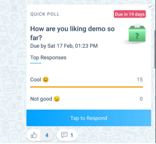
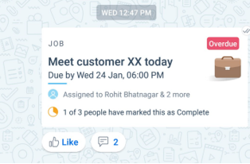
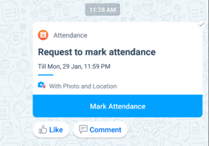
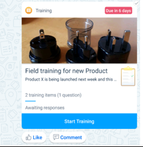
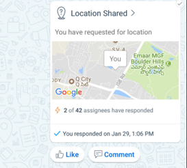
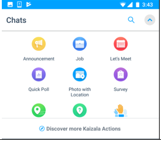

# Kaizala Action Cards

Kaizala offers you a wide range of action cards or mini apps that make your daily work management easy and efficient. You can use the Out-of-box(OOB) Action cards or create your own customized Kaizala Actions.

Some of the OOB Action cards available are as follows:
- Announcements
- Quick Polls & Surveys
- Job/Tasks
- Meeting Invite
- Attendance Card
- Training Card
- Location Card
- Discover More Actions 

## Announcements

Kaizala enables you to share information with your entire organization in one go by means of Announcement card. You can add pictures, audio or video messages as well as documents in Kaizala Announcements.

Receivers of the announcements can engage on this announcements through Likes and Comments feature.

## Quick Polls & Surveys

Kaizala provides predefined Action for Polls and Surveys to quickly collect data from field. Data aggregation is available right there, without having to compile anything.
While Polls support single question, Surveys support multiple questions and question types like Multi-choice, date type, numeric, Text etc.

## Job/Tasks 
Kaizala enables you to assign jobs or tasks to one or more individuals. When your users complete the tasks, you get a notification. Also, you can track status of all your assigned tasks under **Pending Actions** in Profile.

 ## Attendance Card

Attendance card enables you to collect location coordinates, with or without photo from members of your group. This ensures a person is present at specific location at a specific time. You can view the report for the same in Kaizala management portal.

  
## Training Card
Kaizala enables you to send Training Content along with Training questions/quizzes to your team. Report for the same is available on Kaizala management Portal. You can setup Training on Kaizala quickly if training content and questions are ready.

## Location Card

Kaizala provides various location based cards that are as follows:

1. To track on single map current location of your entire group.
2. To track live location coordinates of one or more members.
3. To track photo with location of a person to ensure presence at a location.

## Discover More Actions

You can find many more Kaizala actions under Discover. If you would like to create your own customized actions in Kaizala, you can do that as well. 

Refer to [this](../developer-platform.md) section for details on customizing and creating your own Action cards.
