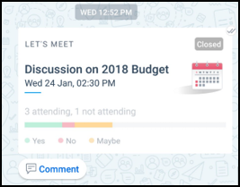

## KAIZALA ACTION CARDS

Kaizala offers you wide range of action cards or mini apps that make your daily work management simpler yet more efficient. You can use the readymade Action cards described below or create your own customized Kaizala Actions. 

<ul><li><b>ANNOUNCEMENTS</b> 
Kaizala enables you to share information with your entire organization in one go by means of Announcement card.You can add pictures, audio or video messages as well as documents in Kaizala Announcements .
Receivers of the announcements can engage on this announcements through Likes and Comments feature.</li></ul>
 
 
 
 
 
 
<ul><li><b>QUICK POLLS & SURVEYS</b>
Kaizala provides readymade Action for Polls and Surveys to quickly collect data from field. Data aggregation is available right there, without having to compile anything.
While Polls support single question, Surveys support multiple questions and question types like Multi-choice, date type, numeric, Text etc. </li></ul>
 
 
 
 
 
<ul><li><b>JOB/TASKS </b>
Kaizala enables you to assign jobs or tasks to one or more individuals. As people complete their tasks, you will get a notification. Also, you can track status of all your assigned tasks under Pending Actions in Profile.</li></ul>
 
 
 
 
<ul><li><b>MEETING INVITE </b>
Kaizala enables you to send meeting invites to entire group and get to know who can attend or not attend the meeting. You can also provide Map pointer for location and Agenda. This is integrated with Device calendar and you will receive reminder before the meeting time.</li></ul>
 
 
 
 
<ul><li><b>ATTENDANCE CARD</b>
Attendance card enables you to collect location coordinates, with or without photo from members of your group. This ensures a person is present at specific location at a specific time.You can view the report for the same in Kaizala management portal.</li></ul>
 
 
 
 
 
<ul><li><b>TRAINING CARD</b>
Kaizala enables you to send Training Content along with Training questions/quizzes to your team. Report for the same is available on Kaizala management Portal. Training can be setup on Kaizala within few minutes if training content and questions are ready.</li></ul>
 
 
 
 
 
 
 
<ul><li><b>LOCATION CARDS</b>
Kaizala provides various location based cards –
1.	To track on single map current location of your entire group.
2.	To track live location coordinates of one or more members.
3.	To track photo with location of a person to ensure presence at a location.|</li></ul>
 
 
 
 
 

<ul><li><b>DISCOVER MORE ACTIONS</b>
You can find many more Kaizala actions under Discover.
If you would like to create your own customized actions in Kaizala, you can do that as well. <Refer to this section for details on customizing and creating your own Action cards|</li></ul>

  
