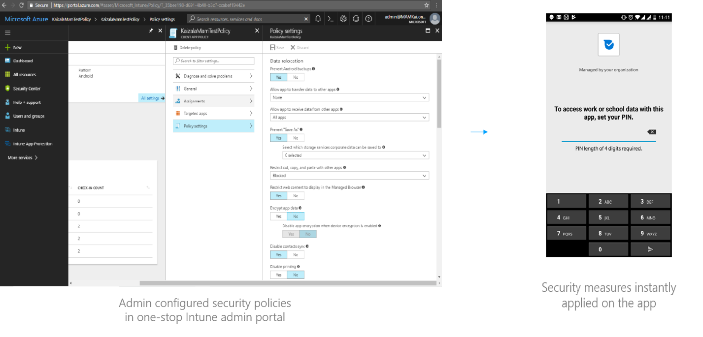

### Client data protection

All the data storages on android, iOS and Windows Clients are done on internal storages which provide Application Sandbox, which isolates your app data and code execution from other apps. User-granted permissions to restrict access to system features and user data are only used. Kaizala follows all the platform standards to restrict access to clients resources based on permissions allowed. No external storage which allows world read and write access, is used. MODE_WORLD_READABLE or MODE_WORLD_WRITEABLE are not enabled. 

### Authentication and authorization

Microsoft Kaizala mobile app authenticates the users on devices using phone number and One Time Password (OTP) for easier signup and onboarding experience.  

For security reasons, Kaizala also applies multiple security policies to restrict one phone number to one device at a time and number of OTP requests in a day.  

Access to all customer data such as messages, documents, media etc. is restricted to the relevant end users, group members and organization administrators. 

Multi-factor authentication for the Kaizala app users can be enabled through group policies. A group or tenant admin may enforce additional Office 365 (AAD) account login to be able to open a Kaizala group. This means that a user must login with AAD linked account in Kaizala mobile app, in addition to phone number & OTP. Until the user logs in with AAD linked account, the messages in the group cannot be seen by the user for the configured group. 

Kaizala Management Portal uses Azure Active Directory services authentication for secure access and management of organizational data. This service is used by millions of customers worldwide for hosting their business data securely in Office 365. 

In Kaizala, full control of group management and memberships is restricted to only group and respective organization administrators. 

### Kaizala Group Policies

Kaizala provides ability for group and tenant admins to control the data flow and behaviour inside a single or all of the organization groups. Following are the various group policies that may be configured by group and tenant admins to enhance data security: 

  
- Restrict forwarding the messages, attachment and Kaizala Actions from the current group or its organizational groups 
- Restrict copying of content for messages, attachments and Kaizala Actions 
- Restrict sharing of content for messages, attachments and Kaizala Actions 
- Enable multi-factor authentication for members via AAD such that user must login with its organization AAD account to view messages inside the group. 
- Enable Microsoft Intune for advanced policies e.g. PIN after idle duration. Unless user enabled Intune, the group may not be opened by the user. 

### Mobile Application Management with Microsoft Intune

For advanced application management, the Kaizala mobile app may be containerized using Microsoft Intune. Microsoft Kaizala is natively integrated with Intune SDK and provides first party support for advanced Intune specific policies listed below:
    - Require PIN access on mobile app for enhanced client security 
    - Block managed apps from running on jailbroken or rooted devices 
    - Restrict cut, copy, paste with other managed apps • Restrict app to transfer data to/ from other managed apps 
    - Block screen capture or screen sharing 
    - Enforce minimum android OS version 
    - Restrict web content to display in the managed browser
    - Offline interval before the data is wiped 

The Intune policies can be easily managed centrally via Intune portal, as shown below:  

