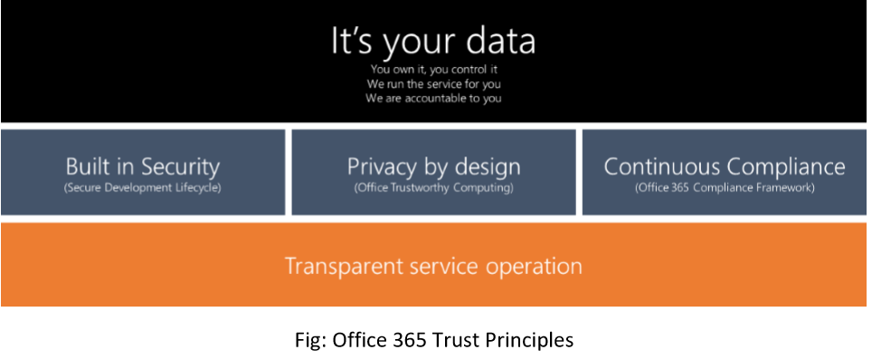

# Security & Compliance - Overview

Security and compliance is one of the core pillars for Microsoft Kaizala, which is developed based on the Office 365 trust principles described below –

  * Kaizala provides full ownership of data to customers for its organization groups. 
  * Kaizala follows standard security development lifecycle (SDL) practices for all phases of the product development including design, development, deployment and operations. The best practices such as defence-in-depth, least privilege access, etc. are applied.
  * Kaizala adheres to Office Trustworthy computing (OTwC) practices to handle the organization and individual data 
  * Kaizala follows Office 365 compliance framework for data handling standards for storage, retention and transmission.
  * Kaizala is hosted on world-class Office 365/ Azure data centre infrastructure, which are run with the transparent service operation
  
This section dives into the approach for security, privacy and compliances practices for Microsoft Kaizala, which not only highlights Microsoft’s commitment towards these but also helps technical and business decision makers to better understand how Microsoft handles customer data with utmost care.

* [Security for end Customers](SecurityFeaturesforendcustomers.md)
* [Security](Security.md)
* [Privacy](Privacy.md)
* [Compliance](Compliance.md)

